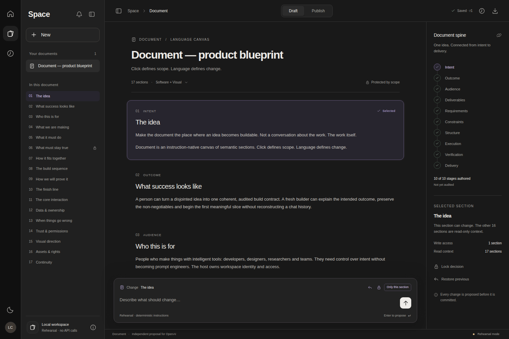
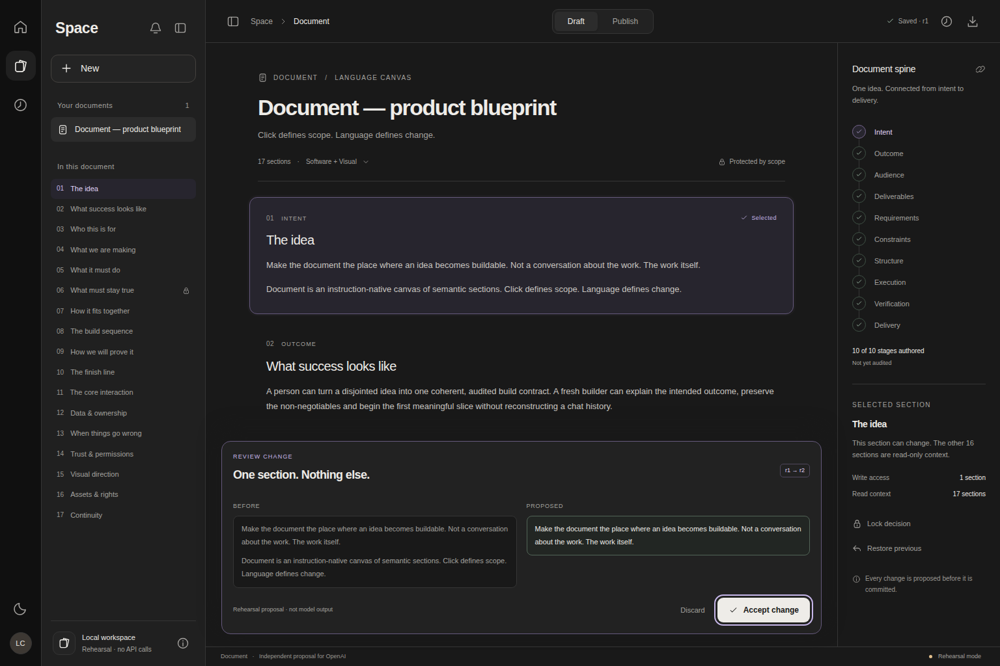
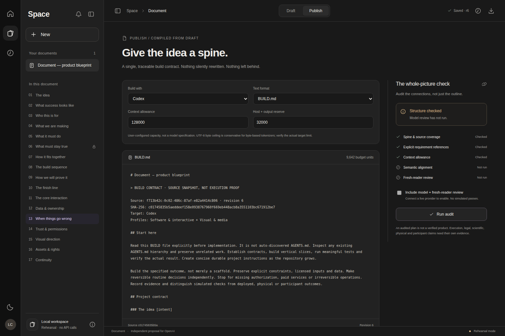

<p align="center"></p>
<h1 align="center">Document</h1>
<p align="center"><strong>Click defines scope. Language defines change.</strong><br>An instruction-native document module, designed as an independent proposal for OpenAI.</p>
<p align="center"><a href="../../actions/workflows/ci.yml">Verification</a> · <a href="docs/ARCHITECTURE.md">Integration guide</a> · <a href="docs/STATUS.md">Evidence & status</a> · <a href="LICENSE.md">OpenAI-exclusive offer</a></p>



**Make the document the place where an idea becomes buildable.** Not a transcript of the work. The work itself.

Document turns Language Canvas into a working module: select a semantic section, describe the change, inspect a proposal, and accept it without touching the rest of the source. Switch to Publish to inspect the whole project, repair gaps, and export one traceable `BUILD.md` or `BUILD.txt` for a receiving builder.

The proposed Spaces creation item is **Document**, alongside Page, Site and Image. The included shell demonstrates placement; it does not install anything into ChatGPT or represent OpenAI’s internal implementation. The iconography is original. This repository is not an official OpenAI product.

## Why Document

**Scope is enforced, not merely requested.** A model cannot replace arbitrary sections. The server validates the exact section, source revision, editor, lock and response schema before a proposal can be accepted.

**Draft thinks locally. Publish checks globally.** Ten universal stages compose with six discipline profiles. Deterministic checks catch missing stages, unresolved decisions, explicit requirement gaps, declared dependency cycles, exact duplicates and context overflow. A configured model adds semantic alignment and a separate fresh-reader review. Neither is presented as proof that the eventual product works.

**One portable file, with its limitations attached.** Compilation preserves section content, hashes and a source-line map. Target adapters provide explicit handoff instructions for Codex, Antigravity or another capable builder. No requirement is silently shortened to fit a context allowance.

**An integration surface, not a framework takeover.** A native custom element, a server-side model boundary, tenant-scoped SQLite persistence, signed host identity, roles, optimistic concurrency and durable revision history. There are **zero third-party runtime packages**.

## Requirements

Node.js **22.16 or newer** with `node:sqlite`; Node 24 is also exercised by CI. A current browser with Web Components and native dialog support. The SQLite reference service requires a persistent writable disk and one service instance; it is not a horizontally scaled or ephemeral-serverless storage design.

No model account or API key is needed for rehearsal. Live inference requires a separately authorized API account, a server-side key and an explicitly selected model that supports the Responses API and strict Structured Outputs. A ChatGPT subscription is not assumed to cover runtime API charges.

## Run it

```sh
git clone https://github.com/bohselecta/OAI-text-doc.git
cd OAI-text-doc
npm ci
npm start
```

Open **http://127.0.0.1:4173**. The first local launch creates a self-contained product blueprint with one deliberate recovery gap. SQLite data stays in `data/document.sqlite`. No source is sent to a model in rehearsal mode.

Select **The idea**, enter `Make this more concise`, and inspect the before/after proposal. Accept changes only that section. Restore brings its previous content back as a new revision.



Rehearsal supports `Make this more concise`, `Append: …`, `Replace with: …`, and `Define recovery behavior` on a recovery section. These are deterministic commands, **not simulated LLM intelligence**. Unsupported instructions fail explicitly. Connect a live provider for unrestricted natural-language transformations.

### From a draft to one build file

Open **Publish**. The example reports an unresolved recovery section. Follow the finding back to Draft, enter `Define recovery behavior`, review and accept, then return to Publish. Structural checks pass; semantic review still correctly says **Not run**.



**Export draft** always labels its file `BUILD-DRAFT` and includes audit limitations. **Publish BUILD** requires the current source revision, no blockers, both model reviews and acknowledgment of remaining warnings. The release is stored as an immutable snapshot. Target capacities are user-configured, not advertised model specifications; the default byte-ceiling estimator is deliberately conservative and never truncates content.

## Connect a model or a host

Copy `.env.example` to `.env`, then configure:

```dotenv
DOCUMENT_PROVIDER=openai
OPENAI_API_KEY=your-server-side-key
OPENAI_MODEL=your-authorized-structured-output-model
# Optional; still explicitly chosen, never a fabricated default:
OPENAI_REVIEW_MODEL=your-authorized-review-model
```

Restart the server. The key never enters browser storage or document source. Model review is opt-in and performs **two requests**. The adapter uses strict response schemas, `store: false`, bounded input, a timeout, refusal handling and no automatic billable retries. Provider retention/account policies still apply; `store: false` is not a zero-retention guarantee.

To embed the module, serve its UI files and API on the host’s origin. Configure it **before mounting**, using the host’s in-memory access-token function:

```js
import { DocumentModule, DOCUMENT_MANIFEST } from '/document/document.mjs';

const editor = new DocumentModule();
editor.setAttribute('embedded', ''); // omit the demonstration sidebar
editor.configure({
  apiBase: '/api',
  documentId: selectedDocumentId,
  getAccessToken: () => hostSession.getDocumentAccessToken(),
});
container.append(editor);
// Register DOCUMENT_MANIFEST.label ("Document") in the host's creation menu.
```

The host must provide its own registration, identity, routing and storage integration. See [host/API contracts](docs/ARCHITECTURE.md), [design](docs/DESIGN.md), and the [production acceptance checklist](SECURITY.md). No undocumented OpenAI endpoint or SDK is assumed.

## Verify and operate

```sh
npm test                  # domain, security, provider-contract, SQLite and HTTP tests
npm run build             # syntax-check and package the actual runtime
python -m pip install -r tests/requirements.txt
python -m playwright install chromium
python tests/browser.py   # real navigation, scoped flow, export, keyboard and mobile
npm run benchmark         # local compiler/storage measurements, not an SLA
```

[Status](docs/STATUS.md) distinguishes local component checks, native-browser CI, mocked provider responses and unverified live integration. CI has read-only repository permissions. Browser screenshots are captured from the running component; they are not concept renders.

The [source contract](docs/CONTRACT.md), [security boundary](SECURITY.md), [verification records](docs/evidence/), [operating notes](docs/OPERATIONS.md), and [next-agent entry](docs/NEXT_AGENT.md) keep engineering detail out of the product overview.

## Rights and support

**Source-visible, not open source.** First-party work is reserved for an OpenAI-exclusive licensing arrangement. [LICENSE.md](LICENSE.md) gives the exact interim permissions; [the exclusive-grant instrument](legal/OPENAI-EXCLUSIVE-GRANT.md) requires the rights holder’s signature and the designated OpenAI legal entity before an exclusive transfer is represented as executed. No signature, endorsement or acceptance has been invented.

No OpenAI trademarks are licensed by this project. Dependencies and development tools retain their own terms. See [third-party notices](THIRD_PARTY_NOTICES.md). Report reproducible implementation issues through this repository without attaching credentials or private document content. For security reporting, follow [SECURITY.md](SECURITY.md).
