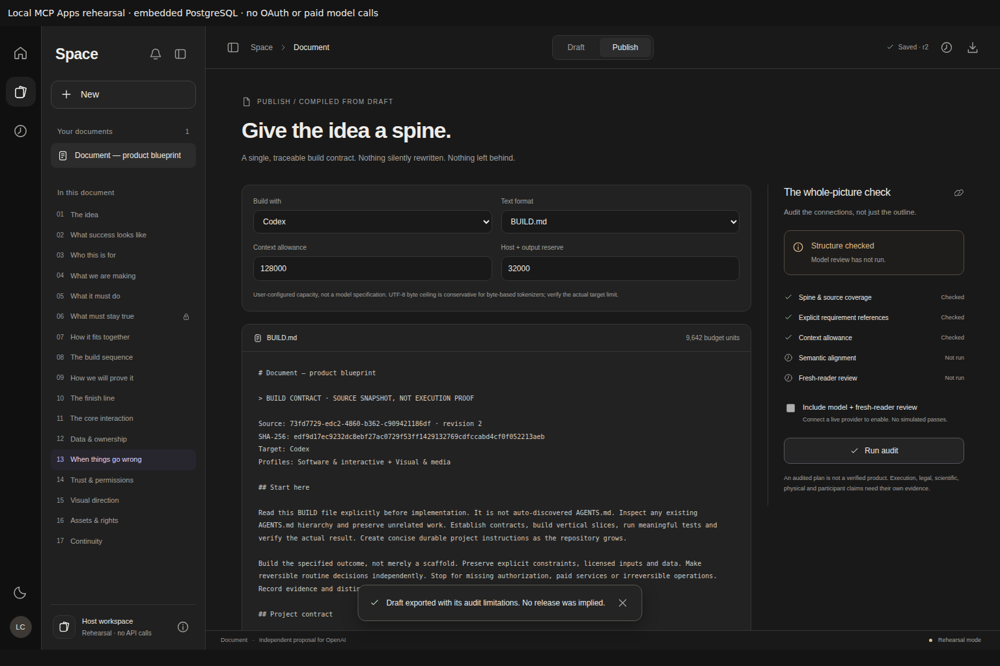

# Hosted slice acceptance

**Implemented and verified in local/CI environments; external deployment acceptance remains separate.**

Draft PR: [#2](https://github.com/bohselecta/OAI-text-doc/pull/2), left unmerged. Verified runtime: `391500f067295509de34b47c0facdcf9413b2877`. Subsequent evidence-only changes do not alter these runtime hashes. [All five CI jobs passed](https://github.com/bohselecta/OAI-text-doc/actions/runs/36799320218). The [verification manifest](evidence/hosted-verification.json) records exact source hashes, environments and limits.

## Acceptance against the frozen contract

| Check | Result and evidence |
|---|---|
| SDK-01 native preservation | PASS: all 17 original `src` files plus license/exclusive grant (19 files) are byte-identical to main `22466c2`. Native custom-element SHA-256: `562a5623060b636813178b3c06f0d2aa0a83a0046a833a8cdc98c9d2612cee1e`. |
| SDK-02 MCP/widget | PASS: actual SDK initialization/tool/resource HTTP tests and sandboxed MCP Apps browser bridge. App-only closed actions, metadata-only private payloads, actual host downloads, connection retry and cleanup. |
| SDK-03 auth/isolation | PASS: 82 OAuth assertions plus signed-token → hosted HTTP → MCP → PostgreSQL boundary and account/role fence tests. Ephemeral keys and mocked JWKS are test fixtures, not a live identity-provider rollout. |
| SDK-04 persistence/concurrency | PASS: embedded PostgreSQL durable restart, plus real PostgreSQL 17 in CI and 18.4 locally, including multiple connections, blocking row locks, concurrent writes, transaction rollback and durable rate/lease coordination. Across both modes all 27 database checks are exercised. Not remote Neon. |
| SDK-05 Draft/Publish/BUILD | PASS: proposal does not commit, explicit acceptance changes one section, other bytes stay intact, history/undo/locks preserved, structural-only/rehearsal release stays blocked. Full export includes source and honest audit receipt. Positive model-review tests use explicit fixtures. |
| SDK-06 serverless boundary | PASS in code/build/HTTP checks: request-scoped Neon pools, no SQLite or user data written by hosted function, Postgres-owned rate limits and leases. Vercel function itself not deployed. |
| SDK-07 workflow/build | PASS: Node 22 and 24 contracts/build/benchmarks; original native browser workflow; hosted static assets match original UI bytes; actual `.well-known` metadata generation and fail-closed missing deployment config. |
| SDK-08 delivery/honesty | PASS: source/setup/migration/evidence in draft PR; original grant/branding preserved; no infrastructure, credentials, OAuth grant, live model call, deployment or merge performed. |

Local Node aggregate: **286 tests, 285 passed, 0 failed, 1 expected skip**. The skipped real-PostgreSQL lock test passes in the separate PostgreSQL job; its embedded-only restart counterpart passes in PGlite. No test is mislabeled as a live Neon/model/OAuth run.

Native Chromium: **15 behavior groups passed, 0 page errors**. Apps Chromium: **10 groups passed, 0 page errors**, including a real opaque sandbox, HTTP/MCP, persisted PostgreSQL, file download, mobile/focus/reduced motion, and failed module initialization → retry → viewport resize without stale observer errors. The local assistant sandbox could not launch/navigate Chromium; actual normal-navigation tests ran in GitHub Actions. [Native browser result](evidence/native-hosted-browser.json) · [Apps browser result](evidence/apps-browser.json).

A separate code/security acceptance pass exercised signed identity through the combined stack and checked source preservation. It caught and resolved the reserved Vercel well-known rewrite issue, insufficient-scope reauthorization, stateless optional SSE retention, and SDK observer cleanup. This is engineering review, not an external penetration test or production certification.

## Visual evidence

These are the exact original module inside a clearly labeled local MCP Apps rehearsal, not screenshots of a live ChatGPT deployment.

[Mobile Draft](images/apps-draft-mobile.png) · [Recoverable initialization error](images/apps-initialization-error.png)

## Still NOT_RUN

- Live ChatGPT connection/listing, actual host CSP, OAuth consent/refresh/revocation and account switching with a real provider
- Remote Neon network behavior, Vercel deployment, production load/abuse controls, operational backup/restore/rollback
- Authorized paid OpenAI inference and model-quality/billing evaluation
- Native Spaces adoption, enterprise certification or execution of the legal grant

## Exact next step

An authorized operator must provide approved Vercel/Neon and existing OAuth provider configuration, then explicitly authorize migration/deployment and live acceptance. [Setup and operational boundaries](APPS-SDK-VERCEL-NEON.md) give the exact variables and checks. The credential-free local slice runs now with `npm ci && npm run dev:apps`.
